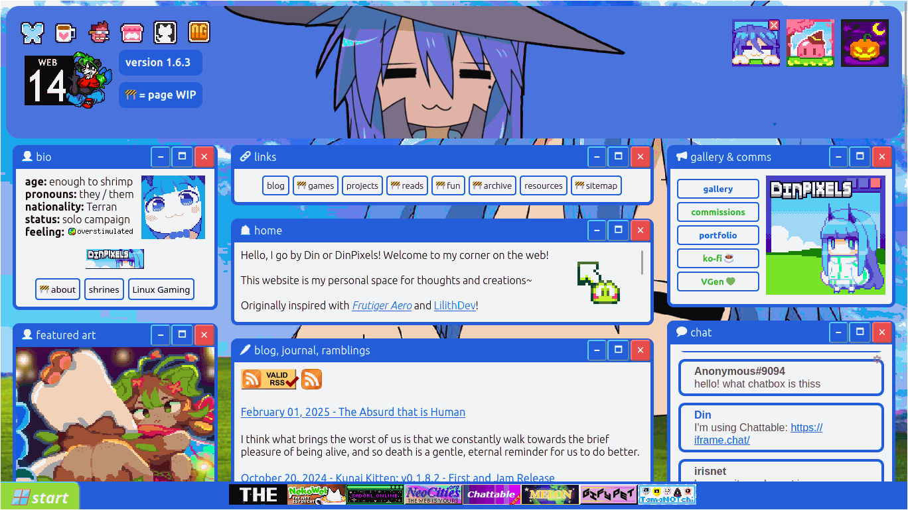

<h1>Hi, I'm  ! 👋(•⩊ •マ &nbsp;</h1>
<table>
<tr>
<td>

</td>
<td>

```gdscript
func _get_data() -> Dictionary:
    return {
        "hobby": ["art", "coding", "games", "eating", "homelabbing (wip)"],
        "interests": [{"obsolete tech", "old web", "emulation", "archiving"},
        {"MMBN/Starforce", "Zero", "Medarot", "Angelic Layer", "Hyper Iria"}]
    }
```

</td>
</tr>
</table>
<p align="right">&nbsp;      </p>
