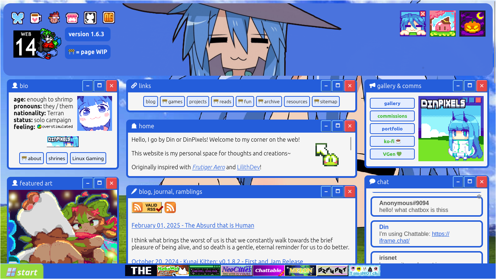
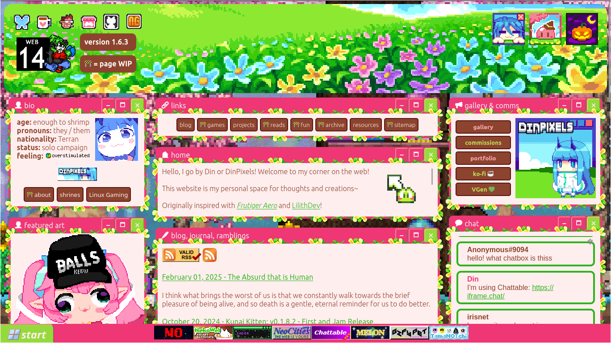
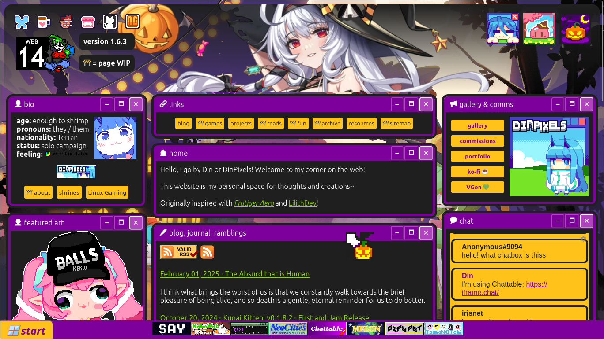

```gdscript
func _get_data() -> Dictionary:
    return {
        "name": "Din",
        "age": Status.Undefined,
        "hobby": ["art", "coding", "games"],
        "skill": [
            "art": ["digital", "pixel art", "3d model"],
            "coding": ["GDScript, "JS", "C++"],
            "games": ["platformer", "puzzle"]
        ],
    }
```

<table>
    <tr>
        <td><a href="https://dinpixels.neocities.org" target="_blank"></a></td>
        <td><a href="https://dinpixels.neocities.org" target="_blank"></a></td>
        <td><a href="https://dinpixels.neocities.org" target="_blank"></a></td>
    </tr>
</table>